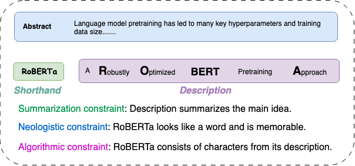

<small>中文 | [EN](README.md) </small>
# 一个好的的标题很重要

`fancytitle` 是一个用于生成、评估和优化简洁且引人入胜的标题或缩写的 Python 包。它提供多种评估指标，确保这些标题的一致性、可读性和创造性。该包帮助你通过平衡以下三个关键因素来创建有效的缩写：

- **Shorthand**: 缩写或简化的标题。
- **Description**: 缩写来源的完整文本或解释。

例如，缩写 `RoBERTa` 代表 "A Robustly Optimized BERT Pretraining Approach"。`fancytitle` 将基于多个指标评估缩写与其描述的匹配程度：

- **WordLikeness**: 评估缩写与真实单词的相似程度。
- **WordCoverage**: 评估缩写与描述中词汇的覆盖程度。
- **LCSRatio**: 检查缩写是否遵循描述中字母的顺序。

## 示例图

为了说明缩写、描述以及各种限制条件之间的关系，请参考以下示例: 




##  🌟 主要特性  

- **摘要**：生成能够概括文本关键思想的描述，例如论文摘要或文章摘要。
- **新词生成**：根据描述建议新的、易记的首字母缩略词，同时遵循缩略词生成的约束条件。
- **算法精确度**：确保缩略词的字母按顺序从描述中提取，以提高清晰度和连贯性。

## 🚀 安装 

您可以直接从源码安装 `fancytitle`：

```bash
git clone https://github.com/cui-shaobo/goodtitle.git
cd fancytitle
pip install .
```

##  🛠️ 使用 

### 1. 作为 Python 脚本使用

您可以在 Python 脚本中使用 `fancytitle` 来评估描述及其对应的缩略词。

#### 示例：使用类方法

`fancy_title_score` 类方法允许您一步完成实例化和评估。
```python
from fancytitle import TitleEvaluator

description = "A Robustly Optimized Pretraining Approach for Language Models"
shorthand = "RoBERTa"

# 使用类方法实例化并评估
final_scores = TitleEvaluator.fancy_title_score(description, shorthand, lowercase=True)
```

这将输出以下内容：
```plaintext
Evaluation Results:
============================================================

Description: a robustly optimized pretraining approach for language models
Shorthand: roberta
------------------------------------------------------------
WordLikeness: 0.5714285714285714
WordCoverage: 0.9230769230769231
LCSRatio: 1.0
============================================================
```

多命题示例
```python
from fancytitle import TitleEvaluator
descriptions = {
    "proposition1": ["A Robustly Optimized Pretraining Approach for Language Models"],
    "proposition2": ["Neural Networks for Image Recognition"]
}
shorthands = {
    "proposition1": ["RoBERTa"],
    "proposition2": ["NNIR"]
}

# 使用类方法实例化并评估
final_scores = TitleEvaluator.from_inputs(descriptions, shorthands, lowercase=True)
```

这将输出以下内容
```plaintext
Evaluation Results:
============================================================

Description: a robustly optimized bert pretraining approach
Shorthand: roberta
------------------------------------------------------------
WordLikeness: 0.5714285714285714
WordCoverage: 0.9230769230769231
LCSRatio: 1.0
============================================================

Description: a training approach for language models
Shorthand: atalm
------------------------------------------------------------
WordLikeness: 0.6
WordCoverage: 0.8
LCSRatio: 1.0
============================================================
```

### `fancy_title_score` 类方法参数

`fancy_title_score` 类方法接受以下参数：

- **descriptions** (dict)：键为示例，值为描述列表的字典。
- **shorthands** (dict)：键为示例，值为缩略词列表的字典。
- **wordlikeness** (bool)：是否计算 WordLikeness 指标（默认：`True`）。
- **wordcoverage** (bool)：是否计算 WordCoverage 指标（默认：`True`）。
- **lcsratio** (bool)：是否计算 LCSRatio 指标（默认：`True`）。
- **lowercase** (bool)：是否在评估前将所有输入转换为小写（默认：`False`）。


## 🤝 贡献 [](./CONTRIBUTING.md) 
我们欢迎您的贡献！如果您想改进此项目，请随时 fork 仓库并提交包含您改进的 pull request。

##  📜 引用  
如果您觉得这个包有用，请给[this repository](https://github.com/cui-shaobo/fancy-title) 和相关仓库：[logogram](https://github.com/cui-shaobo/logogram) 点赞。用于学术目的，请引用我们的论文：
```bibtex
@inproceedings{cui-etal-2024-unveiling,
    title = "Unveiling the Art of Heading Design: A Harmonious Blend of Summarization, Neology, and Algorithm",
    author = "Cui, Shaobo  and
      Feng, Yiyang  and
      Mao, Yisong  and
      Hou, Yifan  and
      Faltings, Boi",
    editor = "Ku, Lun-Wei  and
      Martins, Andre  and
      Srikumar, Vivek",
    booktitle = "Findings of the Association for Computational Linguistics ACL 2024",
    month = aug,
    year = "2024",
    address = "Bangkok, Thailand and virtual meeting",
    publisher = "Association for Computational Linguistics",
    url = "https://aclanthology.org/2024.findings-acl.368",
    doi = "10.18653/v1/2024.findings-acl.368",
    pages = "6149--6174"
}
```

